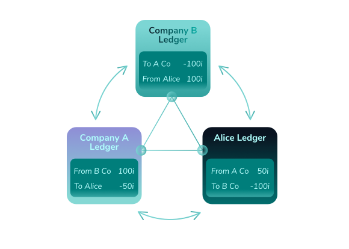

## 1-hello-world.js

This "hello world" example teaches how to get started by finding an IOTA Node.  An IOTA Node contains one view of IOTA's distributed ledger, called the Tangle.




###  Step-by-step explanation of 1-hello-world.js

Import the core library

```
///////////////////////////////
// Environment Check
///////////////////////////////

const iotaLibrary = require('@iota/core')
```

Use DevNet, the developers network

```
const iota = iotaLibrary.composeAPI({
  provider: 'https://nodes.devnet.thetangle.org:443'
})
```

Get node information and display statistics in the console

```
iota
  .getNodeInfo()
  .then(response => console.log(response))
  .catch(err => {
    console.error(err)
  })
```

RESULTS

```
{ appName: 'IRI Devnet',
  appVersion: '1.5.5',
  jreAvailableProcessors: 8,
  jreFreeMemory: 865650588,
  jreVersion: '1.8.0_181',
  jreMaxMemory: 10498867200,
  jreTotalMemory: 2123236204,
  latestMilestone: '99S9YY9GVUTKELZ9FLZL9OGNQHBKKAFLBXMPACXBNVTVWVVJTSDMSUFKFA9LVNPBIRKNUNXFLJOEO9999',
  latestMilestoneIndex: 1007361,
  latestSolidSubtangleMilestone: '99S9YY9GVUTKELZ9FLZL9OGNQHBKKAFLBXMPACXBNVTVWVVJTSDMSUFKFA9LVNPBIRKNUNXFLJOEO9999',
  latestSolidSubtangleMilestoneIndex: 1007361,
  milestoneStartIndex: 434525,
  neighbors: 8,
  packetsQueueSize: 0,
  time: 1545605479963,
  tips: 5074,
  transactionsToRequest: 0,
  features: [ 'RemotePOW', 'testnet' ],
  coordinatorAddress: null,
  duration: 0 }
```

In this example, the node name and version are shown.  There are 8 neighbors in this network.

There is a list of milestones.  Originally, milestones were issued periodically by the Coordinator software.  These milestones were used to achieve consensus.  Starting in December 2018, IOTA began moving towards an improved method for achieving consensus that is more decentralized.  At some point, milestones will no longer be used.  

```
What does a node contain?

(a) Iota Tokens
(b) One view of the distributed ledger
(c) Neighbors
```
